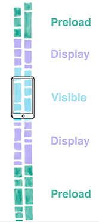

# 简单介绍

AsyncDisplayKit的基本使用单元是node. ASDisplayNode是一个UIView层之上的封装，就像UIView是对CALayer的封装一样。跟View不一样的是，node是线程安全（比如UIView的操作就不是线程安全的，在非UI线程无法操作UIView）的，就是说你在非主线程对node进行初始化以及配置它们的层级操作都是安全的。node和UIView和CALayer的关系：


# 简单使用

下面以我们经常使用的TableView做为对比（分别以view和node作为标记）

### 定义TableView

##### view

```objective-c
@property (strong, nonatomic) UITableView *tableView;

self.tableView = [[UITableView alloc] initWithFrame:CGRectZero style:UITableViewStylePlain];
```

##### node

```objective-c
@property (strong, nonatomic) ASTableNode *tableNode;

self.tableNode = [[ASTableNode alloc] initWithStyle:UITableViewStylePlain];
```

当然，平常的`[self.view addSubview:self.tableView];` 要替换成`[self.view addSubnode:self.tableNode];`，其实addSubnode所做的事情相当于`[self.view addSubview:self.tableNode.view];`。 也就是说当node没提供某些view的属性时，可以通过node.view获取view并进行操作。

### Delegate & DataSource的声明

协议的声明一摸一样🤓

##### view

```objective-c
@implementation ViewController<UITableViewDelegate, UITableViewDataSource>

self.tableView.dataSource = self;
self.tableView.delegate = self;	
```

##### node

```objective-c
@implementation ViewController<ASTableDelegate, ASTableDataSource>

self.tableNode.dataSource = self;
self.tableNode.delegate = self;
```

### DataSource

仅仅是函数名字有些许不同

#### numberOfRowsInSection

##### view

```objective-c
- (NSInteger)tableView:(UITableView *)tableView numberOfRowsInSection:(NSInteger)section {
    return self.sources.count;
}
```

##### node

```objective-c
- (NSInteger)tableNode:(ASTableNode *)tableNode numberOfRowsInSection:(NSInteger)section {
    return self.sources.count;
}
```

#### cellForRowAtIndexPath

##### view

```objective-c
- (UITableViewCell *)tableView:(UITableView *)tableView cellForRowAtIndexPath:(NSIndexPath *)indexPath {
    UITableViewCell *cell = [self.tableView
                             dequeueReusableCellWithIdentifier:kCellReuseIdentifier];

    return cell;
}
```

##### node

```objective-c
- (ASCellNodeBlock)tableNode:(ASTableNode *)tableNode nodeBlockForRowAtIndexPath:(NSIndexPath *)indexPath {
      return ^{
      ASCellNode *cardNode = [[ASCellNode alloc] initWithAnimal:animal];
      return cardNode;
    };
}
```

> 1. ASCellNode和UITableViewCell 或 UICollectionViewCell是对等的。不同的是在node里，返回的是一个block，这样AsyncDisplayKit就能在后台完成cell的工作并在准备好要显示的时候才返回，提高了效率也保证了线程安全；
> 2. 值得注意的是，这里不用担心cell的reuse，再也不需要cell的`identifier`了，ASCellNode已经替我们完成了。

#### heightForRowAtIndexPath

##### view

`-tableView:heightForRowAtIndexPath:`

##### node

并没有这个方法！！！

> 在ASDK，ASCellNodes会自己计算它们所需要的高度，与提供固定高度相比，ASDK允许我们有选择性的提供cell高度的范围，比如最少需要2/3屏幕的高度

```objective-c
- (ASSizeRange)tableNode:(ASTableView *)tableView constrainedSizeForRowAtIndexPath:(NSIndexPath *)indexPath {
    CGSize min = CGSizeMake([UIScreen mainScreen].bounds.size.width, ([UIScreen   mainScreen].bounds.size.height/3) * 2);
    CGSize max = CGSizeMake([UIScreen mainScreen].bounds.size.width, INFINITY);
    return ASSizeRangeMake(min, max);
}
```

#### 分页

对于TableView来说，经常需要提供加载更多的功能，我们需要写一堆代码去控制。在ASDK中，提供了很方便的功能`leadingScreensForBatching`，大概情况如下图：



当然还有一些辅助方法需要实现：

```objective-c
- (BOOL)shouldBatchFetchForTableNode:(ASTableNode *)tableNode {
    return YES;
}

- (void)tableNode:(ASTableNode *)tableNode willBeginBatchFetchWithContext:(ASBatchContext *)context {
    [self retrieveNextPageWithCompletion:^(NSArray *animals) {
        [self insertNewRowsInTableNode:animals];
        [context completeBatchFetching:YES];
    }];
}

- (void)retrieveNextPageWithCompletion:(void (^)(NSArray *))block {
    NSArray *moreAnimals = [[NSArray alloc] initWithArray:
                            [self.animals subarrayWithRange:NSMakeRange(0, 5)] copyItems:NO];

  // Important: this block must run on the main thread
    dispatch_async(dispatch_get_main_queue(), ^{
        block(moreAnimals);
    });
}

- (void)insertNewRowsInTableNode:(NSArray *)newAnimals {
    NSInteger section = 0;
    NSMutableArray *indexPaths = [NSMutableArray array];

    NSUInteger newTotalNumberOfPhotos = self.animals.count + newAnimals.count;
    for (NSUInteger row = self.animals.count; row < newTotalNumberOfPhotos; row++) {
        NSIndexPath *path = [NSIndexPath indexPathForRow:row inSection:section];
            [indexPaths addObject:path];
    }

  [self.animals addObjectsFromArray:newAnimals];
  [self.tableNode insertRowsAtIndexPaths:indexPaths withRowAnimation:UITableViewRowAnimationNone];
}
```

# 总结

ASDK确实对性能有很大的提升，可并不是每次都需要用到ASDK，只有在App的性能需要优化的时候才需要考虑使用。


