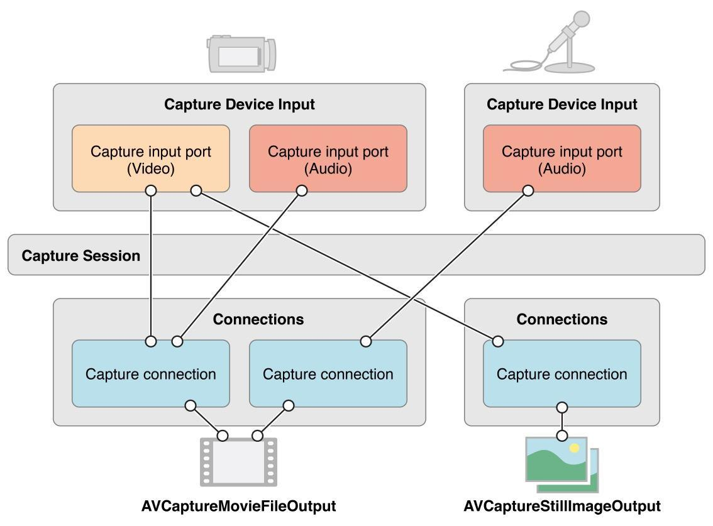

# iOS 相机

第一个 iPhone 出现的时候就带有相机功能, 在早期的iOS系统中, 使用相机的唯一方式 是 `UIImagePickerController`, 到了 iOS 4, 发布了更灵活的 `AVFoundation` 框架

UIImagePickerController 提供了一种非常简单的拍照方法。它支持所有的基本功能，比如切换到前置摄像头，开关闪光灯，点击屏幕区域实现对焦和曝光，以及在 iOS 8 中像系统照相机应用一样调整曝光。

然而，当有直接访问相机的需求时，也可以选择 AVFoundation 框架。它提供了完全的操作权，例如，以编程方式更改硬件参数，或者操纵实时预览图。

## 框架结构

AVFoundation 框架基于以下几个类实现图像捕捉 ，通过这些类可以访问来自相机设备的原始数据并控制它的组件。

* AVCaptureDevice 是关于相机硬件的接口。它被用于控制硬件特性，诸如镜头的位置、曝光、闪光灯等。
* AVCaptureDeviceInput 提供来自设备的数据。
* AVCaptureOutput 是一个抽象类，描述 capture session 的结果。以下是三种关于静态图片捕捉的具体子类：
    - AVCaptureStillImageOutput 用于捕捉静态图片
    - AVCaptureMetadataOutput 启用检测人脸和二维码
    - AVCaptureVideoOutput 为实时预览图提供原始帧
* AVCaptureSession 管理输入与输出之间的数据流，以及在出现问题时生成运行时错误。
* AVCaptureVideoPreviewLayer 是 CALayer 的子类，可被用于自动显示相机产生的实时图像。它还有几个工具性质的方法，可将 layer 上的坐标转化到设备上。它看起来像输出，但其实不是。另外，它拥有 session (outputs 被 session 所拥有)。

一个session可以管理多个输入输出设备，如下图所示



## 初始化

初始化 AVCaptureSession 对象
```swift
let session = AVCaptureSession()
```

选择可用的输入设备

```swift
let availableCameraDevices = AVCaptureDevice.devicesWithMediaType(AVMediaTypeVideo)
for device in availableCameraDevices as [AVCaptureDevice] {
  if device.position == .Back {
    backCameraDevice = device
  }
  else if device.position == .Front {
    frontCameraDevice = device
  }
}
```

然后，一旦我们发现合适的相机设备，我们就能获得相关的 AVCaptureDeviceInput 对象。我们会将它设置为 session 的输入：

```swift
var error:NSError?
let possibleCameraInput: AnyObject? = AVCaptureDeviceInput.deviceInputWithDevice(backCameraDevice, error: &error)
if let backCameraInput = possibleCameraInput as? AVCaptureDeviceInput {
  if self.session.canAddInput(backCameraInput) {
    self.session.addInput(backCameraInput)
  }
}
```

## 权限处理

注意当 app 首次运行时，第一次调用 AVCaptureDeviceInput.deviceInputWithDevice() 会触发系统提示，向用户请求访问相机。这在 iOS 7 的时候只有部分国家会有，到了 iOS 8 拓展到了所有地区。除非得到用户同意，否则相机的输入会一直是一个黑色画面的数据流。

对于处理相机的权限，更合适的方法是先确认当前的授权状态。要是在授权还没有确定的情况下 (也就是说用户还没有看过弹出的授权对话框时)，我们应该明确地发起请求。

```swift
let authorizationStatus = AVCaptureDevice.authorizationStatusForMediaType(AVMediaTypeVideo)
switch authorizationStatus {
case .NotDetermined:
  // 许可对话没有出现，发起授权许可
  AVCaptureDevice.requestAccessForMediaType(AVMediaTypeVideo,
    completionHandler: { (granted:Bool) -> Void in
    if granted {
      // 继续
    }
    else {
      // 用户拒绝，无法继续
    }
  })
case .Authorized:
  // 继续
case .Denied, .Restricted:
  // 用户明确地拒绝授权，或者相机设备无法访问
}
```

## 预览

我们有两种方式来显示来自相机的图像流, 最简单的是使用AVCaptureVideoPreviewLayer

```swift
previewLayer = AVCaptureVideoPreviewLayer.layerWithSession(session) as AVCaptureVideoPreviewLayer
previewLayer.frame = view.bounds
view.layer.addSublayer(previewLayer)
```

AVCaptureVideoPreviewLayer 会自动地显示来自相机的输出。当我们需要将实时预览图上的点击转换到设备的坐标系统中，比如点击某区域实现对焦时，这种做法会很容易办到

第二种方法是从输出数据流捕捉单一的图像帧，并使用 OpenGL 手动地把它们显示在 view 上, 这样可以实现实时滤镜的效果, 不过实现比较复杂, 一般使用 GPUImage 作为整体解决方案

## 配置

```swift
session.sessionPreset = AVCaptureSessionPresetPhoto
```

AVCaptureSessionPresetPhoto 会为照片捕捉选择最合适的配置，比如它可以允许我们使用最高的感光度 (ISO) 和曝光时间，基于相位检测 (phase detection)的自动对焦, 以及输出全分辨率的 JPEG 格式压缩的静态图片。

## 分辨率

有时候我们需要精细地控制相机的分辨率,[各个机型的分辨率](http://stackoverflow.com/questions/19422322/method-to-find-devices-camera-resolution-ios),可以通过AVCaptureDeviceFormat去设置

```swift
let resolution = self.resolution
for format in device.formats as! [AVCaptureDeviceFormat] {
    if CMFormatDescriptionGetMediaSubType(format.formatDescription) != kCVPixelFormatType_420YpCbCr8BiPlanarFullRange {
        continue
    }
    let dis = CMVideoFormatDescriptionGetDimensions(format.formatDescription)
    if dis.width == Int32(resolution.width) && dis.height == Int32(resolution.height) {
    	try device.lockForConfiguration()
        device.activeFormat = format
        device.unlockForConfiguration()
        
        return
    }
}
```
## 操作相机

启动相机

```swift
sessionQueue = dispatch_queue_create("com.example.camera.capture_session", DISPATCH_QUEUE_SERIAL)
dispatch_async(sessionQueue) { () -> Void in
  self.session.startRunning()
}
```

在 session 和相机设备中完成的所有操作和配置都是利用 block 调用的。因此，建议将这些操作分配到后台的串行队列中。此外，相机设备在改变某些参数前必须先锁定，直到改变结束才能解锁，例如：

```swift
var error:NSError?
if currentDevice.lockForConfiguration(&error) {
  // 锁定成功，继续配置
  // currentDevice.unlockForConfiguration()
} else {
  // 出错，相机可能已经被锁
}
```

## 对焦

在 iOS 相机上，对焦是通过移动镜片改变其到传感器之间的距离实现的。

自动对焦是通过相位检测和反差检测实现的。然而，反差检测只适用于低分辨率和高 FPS 视频捕捉 (慢镜头)。[相位对焦和反差对焦](http://ask.zealer.com/question/149.html)

`AVCaptureFocusMode` 是个枚举，描述了可用的对焦模式：

- `Locked` 指镜片处于固定位置
- `AutoFocus` 指一开始相机会先自动对焦一次，然后便处于 Locked 模式。
- `ContinuousAutoFocus` 指当场景改变，相机会自动重新对焦到画面的中心点。

通常情况下，AutoFocus 模式会试图让屏幕中心成为最清晰的区域，但是也可以通过变换 “感兴趣的点 (point of interest)” 来设定另一个区域。这个点是一个 CGPoint，它的值从左上角 {0，0} 到右下角 {1，1}，{0.5，0.5} 为画面的中心点。通常可以用视频预览图上的点击手势识别来改变这个点，想要将 view 上的坐标转化到设备上的规范坐标，我们可以使用 

```swift
AVVideoCaptureVideoPreviewLayer.captureDevicePointOfInterestForPoint()：
```

```swift
var pointInPreview = focusTapGR.locationInView(focusTapGR.view)
var pointInCamera = previewLayer.captureDevicePointOfInterestForPoint(pointInPreview)
...// 锁定，配置

// 设置感兴趣的点
currentCameraDevice.focusPointOfInterest = pointInCamera

// 在设置的点上切换成自动对焦
currentCameraDevice.focusMode = .AutoFocus

...// 解锁
```

在 iOS 8 中，有个新选项可以移动镜片的位置，从较近物体的 0.0 到较远物体的 1.0 (不是指无限远)。

```swift
... // 锁定，配置
var lensPosition:Float = ... // 0.0 到 1.0的float
currentCameraDevice.setFocusModeLockedWithLensPosition(lensPosition) {
  (timestamp:CMTime) -> Void in
  // timestamp 对应于应用了镜片位置的第一张图像缓存区
}
... // 解锁
```

## 伸缩
可以通过调整 device 的 zoom factor 来伸缩镜头的范围

```swift
func setZoomFactor(zoomFactor: Float) {
    self.changeDeviceProperty { device in
        device.videoZoomFactor = CGFloat(zoomFactor)
    }
}
```

## 闪光灯

闪光灯有3种状态: auto, on, off, 拍照时对应的属性是`flashMode`,录制视频时对应的属性是`torchMode`,可以将这两种属性的设置统一起来

```
func setFlashlight() {
        let rawValue = UserDefaults.standard.integer(forKey: K.UserDefault.FlashlightType)
        let currentType = CameraFlashlightType.init(rawValue: rawValue) ?? .auto
        
        var flashMode: AVCaptureFlashMode = .auto
        var torchMode: AVCaptureTorchMode = .auto
        
        switch currentType {
        case .auto:
            flashMode = .auto
            torchMode = .auto
        case .on:
            flashMode = .on
            torchMode = .on
        case .off: 
            flashMode = .off
            torchMode = .off
        }
        
        switch self.currentCaptureType {
        case .photo, .squrePhoto, .burstPhoto, .quickPhoto:
            self.changeDeviceProperty({ (device) in
                if device.hasFlash && device.isFlashModeSupported(flashMode) {
                    device.flashMode = flashMode
                }
            })
        case .video, .slowVideo:
            self.changeDeviceProperty({ (device) in
                if device.hasTorch && device.isTorchModeSupported(torchMode) {
                    device.torchMode = torchMode
                }
            })
        }
    }
```

## 曝光

在 iOS 设备上，镜头上的光圈是固定的 (在 iPhone 5s 以及其之后的光圈值是 f/2.2，之前的是 f/2.4)，因此只有改变曝光时间和传感器的灵敏度才能对图片的亮度进行调整，从而达到合适的效果。至于对焦，我们可以选择连续自动曝光，在“感兴趣的点”一次性自动曝光，或者手动曝光。除了指定“感兴趣的点”，我们可以通过设置曝光补偿 (compensation) 修改自动曝光，也就是曝光档位的目标偏移。目标偏移在曝光档数里有讲到，它的范围在 minExposureTargetBias 与 maxExposureTargetBias 之间，0为默认值 (即没有“补偿”)。

```swift
var exposureBias:Float = ... // 在 minExposureTargetBias 和 maxExposureTargetBias 之间的值
... // 锁定，配置
currentDevice.setExposureTargetBias(exposureBias) { (time:CMTime) -> Void in
}
... // 解锁
```

使用手动曝光，我们可以设置 ISO 和曝光时间，两者的值都必须在设备当前格式所指定的范围内。

```swift
var activeFormat = currentDevice.activeFormat
var duration:CTime = ... //在activeFormat.minExposureDuration 和 activeFormat.maxExposureDuration 之间的值，或用 AVCaptureExposureDurationCurrent 表示不变
var iso:Float = ... // 在 activeFormat.minISO 和 activeFormat.maxISO 之间的值，或用 AVCaptureISOCurrent 表示不变
... // 锁定，配置
currentDevice.setExposureModeCustomWithDuration(duration, ISO: iso) { (time:CMTime) -> Void in
}
... // 解锁
```

如何知道照片曝光是否正确呢？我们可以通过 KVO，观察 AVCaptureDevice 的 exposureTargetOffset 属性，确认是否在 0 附近。

## 白平衡

数码相机为了适应不同类型的光照条件需要补偿。这意味着在冷光线的条件下，传感器应该增强红色部分，而在暖光线下增强蓝色部分。在 iPhone 相机中，设备会自动决定合适的补光，但有时也会被场景的颜色所混淆失效。幸运地是，iOS 8 可以里手动控制白平衡。

自动模式工作方式和对焦、曝光的方式一样，但是没有“感兴趣的点”，整张图像都会被纳入考虑范围。在手动模式，我们可以通过开尔文所表示的温度来调节色温和色彩。典型的色温值在 2000-3000K (类似蜡烛或灯泡的暖光源) 到 8000K (纯净的蓝色天空) 之间。色彩范围从最小的 -150 (偏绿) 到 150 (偏品红)。

温度和色彩可以被用于计算来自相机传感器的恰当的 RGB 值，因此仅当它们做了基于设备的校正后才能被设置。

以下是全部过程：

```swift
var incandescentLightCompensation = 3_000
var tint = 0 // 不调节
let temperatureAndTintValues = AVCaptureWhiteBalanceTemperatureAndTintValues(temperature: incandescentLightCompensation, tint: tint)
var deviceGains = currentCameraDevice.deviceWhiteBalanceGainsForTemperatureAndTintValues(temperatureAndTintValues)
... // 锁定，配置
currentCameraDevice.setWhiteBalanceModeLockedWithDeviceWhiteBalanceGains(deviceGains) {
        (timestamp:CMTime) -> Void in
    }
  }
... // 解锁
```

##实时人脸检测

AVCaptureMetadataOutput 可以用于检测人脸和二维码这两种物体。很明显，没什么人用二维码 (编者注: 因为在欧美现在二维码不是很流行，这里是一个恶搞。链接的这个 tumblr 博客的主题是 “当人们在扫二维码时的图片”，但是 2012 年开博至今没有任何一张图片，暗讽二维码根本没人在用，这和以中日韩为代表的亚洲用户群体的使用习惯完全相悖)，因此我们就来看看如何实现人脸检测。我们只需通过 AVCaptureMetadataOutput 的代理方法捕获的元对象：

```swift
var metadataOutput = AVCaptureMetadataOutput()
metadataOutput.setMetadataObjectsDelegate(self, queue: self.sessionQueue)
if session.canAddOutput(metadataOutput) {
  session.addOutput(metadataOutput)
}
metadataOutput.metadataObjectTypes = [AVMetadataObjectTypeFace]

func captureOutput(captureOutput: AVCaptureOutput!, didOutputMetadataObjects metadataObjects: [AnyObject]!, fromConnection connection: AVCaptureConnection!) {
    for metadataObject in metadataObjects as [AVMetadataObject] {
      if metadataObject.type == AVMetadataObjectTypeFace {
        var transformedMetadataObject = previewLayer.transformedMetadataObjectForMetadataObject(metadataObject)
      }
    }
}
```
更多关于人脸检测与识别的内容请查看[这篇文章](https://objccn.io/issue-21-9/)

## 捕捉静态图片

最后，我们要做的是捕捉高分辨率的图像，于是我们调用 captureStillImageAsynchronouslyFromConnection(connection, completionHandler)。在数据时被读取时，completion handler 将会在某个未指定的线程上被调用。

如果设置使用 JPEG 编码作为静态图片输出，不管是通过 session .Photo 预设设定的，还是通过设备输出设置设定的，sampleBuffer 都会返回包含图像的元数据。如果在 AVCaptureMetadataOutput 中是可用的话，这会包含 EXIF 数据，或是被识别的人脸等：

```
dispatch_async(sessionQueue) { () -> Void in

  let connection = self.stillCameraOutput.connectionWithMediaType(AVMediaTypeVideo)

  // 将视频的旋转与设备同步
  connection.videoOrientation = AVCaptureVideoOrientation(rawValue: UIDevice.currentDevice().orientation.rawValue)!

  self.stillCameraOutput.captureStillImageAsynchronouslyFromConnection(connection) {
    (imageDataSampleBuffer, error) -> Void in

    if error == nil {

      // 如果使用 session .Photo 预设，或者在设备输出设置中明确进行了设置
      // 我们就能获得已经压缩为JPEG的数据

      let imageData = AVCaptureStillImageOutput.jpegStillImageNSDataRepresentation(imageDataSampleBuffer)

      // 样本缓冲区也包含元数据，我们甚至可以按需修改它

      let metadata:NSDictionary = CMCopyDictionaryOfAttachments(nil, imageDataSampleBuffer, CMAttachmentMode(kCMAttachmentMode_ShouldPropagate)).takeUnretainedValue()

      if let image = UIImage(data: imageData) {
        // 保存图片，或者做些其他想做的事情
        ...
      }
    }
    else {
      NSLog("error while capturing still image: \(error)")
    }
  }
}
```

当图片被捕捉的时候，有视觉上的反馈是很好的体验。想要知道何时开始以及何时结束的话，可以使用 KVO 来观察 AVCaptureStillImageOutput 的 isCapturingStillImage 属性。

## 分级捕捉

在 iOS 8 还有一个有趣的特性叫“分级捕捉”，可以在不同的曝光设置下拍摄几张照片。这在复杂的光线下拍照显得非常有用，例如，通过设定 -1、0、1 三个不同的曝光档数，然后用 HDR 算法合并成一张。

以下是代码实现：

```swift
dispatch_async(sessionQueue) { () -> Void in
  let connection = self.stillCameraOutput.connectionWithMediaType(AVMediaTypeVideo)
  connection.videoOrientation = AVCaptureVideoOrientation(rawValue: UIDevice.currentDevice().orientation.rawValue)!

  var settings = [-1.0, 0.0, 1.0].map {
    (bias:Float) -> AVCaptureAutoExposureBracketedStillImageSettings in

    AVCaptureAutoExposureBracketedStillImageSettings.autoExposureSettingsWithExposureTargetBias(bias)
  }

  var counter = settings.count

  self.stillCameraOutput.captureStillImageBracketAsynchronouslyFromConnection(connection, withSettingsArray: settings) {
    (sampleBuffer, settings, error) -> Void in

    ...
    // 保存 sampleBuffer(s)

    // 当计数为0，捕捉完成
    counter--

  }
}
```

# GPUImage

GPUImage 是一个 iOS 开源库, 可以给图片,视频,相机添加滤镜和一些其他的效果

## 实时滤镜

在前面的[预览](#预览)中有提到, 相机的输入有两种方式显示在屏幕上,GPUImage使用的是第二种方式,通过OpenGL将每一帧的画面绘制在`GPUImageView`上,这样我们就可以添加实时滤镜效果 

```swift
GPUImageVideoCamera *videoCamera = [[GPUImageVideoCamera alloc] initWithSessionPreset:AVCaptureSessionPreset640x480 cameraPosition:AVCaptureDevicePositionBack];
videoCamera.outputImageOrientation = UIInterfaceOrientationPortrait;

GPUImageFilter *customFilter = [[GPUImageFilter alloc] initWithFragmentShaderFromFile:@"CustomShader"];
GPUImageView *filteredVideoView = [[GPUImageView alloc] initWithFrame:CGRectMake(0.0, 0.0, viewWidth, viewHeight)];

// Add the view somewhere so it's visible

[videoCamera addTarget:customFilter];
[customFilter addTarget:filteredVideoView];

[videoCamera startCameraCapture];
```

shader 是一种自定义滤镜的格式, 格式类似于:

```C++
varying highp vec2 textureCoordinate;  
  
uniform sampler2D inputImageTexture;  
  
void main()  
{  
    lowp vec3 tc = vec3(1.0, 0.0, 0.0);  
  
    lowp vec3 pixcol = texture2D(inputImageTexture, textureCoordinate).rgb;  
    lowp vec3 colors[3];  
    colors[0] = vec3(0.0, 0.0, 1.0);  
    colors[1] = vec3(1.0, 1.0, 0.0);  
    colors[2] = vec3(1.0, 0.0, 0.0);  
    mediump float lum = (pixcol.r + pixcol.g + pixcol.b) / 3.0;  
    int ix = (lum < 0.5)? 0:1;  
    tc = mix(colors[ix], colors[ix + 1], (lum - float(ix) * 0.5) / 0.5);  
  
    gl_FragColor = vec4(tc, 1.0);  
}  
```


## 自定义滤镜
GPUImage自带的滤镜如下

```swift
// 调整颜色 Handle Color

GPUImageBrightnessFilter                //亮度
GPUImageExposureFilter                  //曝光
GPUImageContrastFilter                  //对比度
GPUImageSaturationFilter                //饱和度
GPUImageGammaFilter                     //伽马线
GPUImageColorInvertFilter               //反色
GPUImageSepiaFilter                     //褐色（怀旧）
GPUImageLevelsFilter                    //色阶
GPUImageGrayscaleFilter                 //灰度
GPUImageHistogramFilter                 //色彩直方图，显示在图片上
GPUImageHistogramGenerator              //色彩直方图
GPUImageRGBFilter                       //RGB
GPUImageToneCurveFilter                 //色调曲线
GPUImageMonochromeFilter                //单色
GPUImageOpacityFilter                   //不透明度
GPUImageHighlightShadowFilter           //提亮阴影
GPUImageFalseColorFilter                //色彩替换（替换亮部和暗部色彩）
GPUImageHueFilter                       //色度
GPUImageChromaKeyFilter                 //色度键
GPUImageWhiteBalanceFilter              //白平横
GPUImageAverageColor                    //像素平均色值
GPUImageSolidColorGenerator             //纯色
GPUImageLuminosity                      //亮度平均
GPUImageAverageLuminanceThresholdFilter //像素色值亮度平均，图像黑白（有类似漫画效果）

GPUImageLookupFilter                    //lookup 色彩调整
GPUImageAmatorkaFilter                  //Amatorka lookup
GPUImageMissEtikateFilter               //MissEtikate lookup
GPUImageSoftEleganceFilter              //SoftElegance lookup

// 图像处理 Handle Image

GPUImageCrosshairGenerator              //十字
GPUImageLineGenerator                   //线条

GPUImageTransformFilter                 //形状变化
GPUImageCropFilter                      //剪裁
GPUImageSharpenFilter                   //锐化
GPUImageUnsharpMaskFilter               //反遮罩锐化

GPUImageFastBlurFilter                  //模糊
GPUImageGaussianBlurFilter              //高斯模糊
GPUImageGaussianSelectiveBlurFilter     //高斯模糊，选择部分清晰
GPUImageBoxBlurFilter                   //盒状模糊
GPUImageTiltShiftFilter                 //条纹模糊，中间清晰，上下两端模糊
GPUImageMedianFilter                    //中间值，有种稍微模糊边缘的效果
GPUImageBilateralFilter                 //双边模糊
GPUImageErosionFilter                   //侵蚀边缘模糊，变黑白
GPUImageRGBErosionFilter                //RGB侵蚀边缘模糊，有色彩
GPUImageDilationFilter                  //扩展边缘模糊，变黑白
GPUImageRGBDilationFilter               //RGB扩展边缘模糊，有色彩
GPUImageOpeningFilter                   //黑白色调模糊
GPUImageRGBOpeningFilter                //彩色模糊
GPUImageClosingFilter                   //黑白色调模糊，暗色会被提亮
GPUImageRGBClosingFilter                //彩色模糊，暗色会被提亮
GPUImageLanczosResamplingFilter         //Lanczos重取样，模糊效果
GPUImageNonMaximumSuppressionFilter     //非最大抑制，只显示亮度最高的像素，其他为黑
GPUImageThresholdedNonMaximumSuppressionFilter //与上相比，像素丢失更多

GPUImageSobelEdgeDetectionFilter        //Sobel边缘检测算法(白边，黑内容，有点漫画的反色效果)
GPUImageCannyEdgeDetectionFilter        //Canny边缘检测算法（比上更强烈的黑白对比度）
GPUImageThresholdEdgeDetectionFilter    //阈值边缘检测（效果与上差别不大）
GPUImagePrewittEdgeDetectionFilter      //普瑞维特(Prewitt)边缘检测(效果与Sobel差不多，貌似更平滑)
GPUImageXYDerivativeFilter              //XYDerivative边缘检测，画面以蓝色为主，绿色为边缘，带彩色
GPUImageHarrisCornerDetectionFilter     //Harris角点检测，会有绿色小十字显示在图片角点处
GPUImageNobleCornerDetectionFilter      //Noble角点检测，检测点更多
GPUImageShiTomasiFeatureDetectionFilter //ShiTomasi角点检测，与上差别不大
GPUImageMotionDetector                  //动作检测
GPUImageHoughTransformLineDetector      //线条检测
GPUImageParallelCoordinateLineTransformFilter //平行线检测

GPUImageLocalBinaryPatternFilter        //图像黑白化，并有大量噪点

GPUImageLowPassFilter                   //用于图像加亮
GPUImageHighPassFilter                  //图像低于某值时显示为黑

// 视觉效果 Visual Effect

GPUImageSketchFilter                    //素描
GPUImageThresholdSketchFilter           //阀值素描，形成有噪点的素描
GPUImageToonFilter                      //卡通效果（黑色粗线描边）
GPUImageSmoothToonFilter                //相比上面的效果更细腻，上面是粗旷的画风
GPUImageKuwaharaFilter                  //桑原(Kuwahara)滤波,水粉画的模糊效果；处理时间比较长，慎用

GPUImageMosaicFilter                    //黑白马赛克
GPUImagePixellateFilter                 //像素化
GPUImagePolarPixellateFilter            //同心圆像素化
GPUImageCrosshatchFilter                //交叉线阴影，形成黑白网状画面
GPUImageColorPackingFilter              //色彩丢失，模糊（类似监控摄像效果）

GPUImageVignetteFilter                  //晕影，形成黑色圆形边缘，突出中间图像的效果
GPUImageSwirlFilter                     //漩涡，中间形成卷曲的画面
GPUImageBulgeDistortionFilter           //凸起失真，鱼眼效果
GPUImagePinchDistortionFilter           //收缩失真，凹面镜
GPUImageStretchDistortionFilter         //伸展失真，哈哈镜
GPUImageGlassSphereFilter               //水晶球效果
GPUImageSphereRefractionFilter          //球形折射，图形倒立
    
GPUImagePosterizeFilter                 //色调分离，形成噪点效果
GPUImageCGAColorspaceFilter             //CGA色彩滤镜，形成黑、浅蓝、紫色块的画面
GPUImagePerlinNoiseFilter               //柏林噪点，花边噪点
GPUImage3x3ConvolutionFilter            //3x3卷积，高亮大色块变黑，加亮边缘、线条等
GPUImageEmbossFilter                    //浮雕效果，带有点3d的感觉
GPUImagePolkaDotFilter                  //像素圆点花样
GPUImageHalftoneFilter                  //点染,图像黑白化，由黑点构成原图的大致图形


// 混合模式 Blend

GPUImageMultiplyBlendFilter             //通常用于创建阴影和深度效果
GPUImageNormalBlendFilter               //正常
GPUImageAlphaBlendFilter                //透明混合,通常用于在背景上应用前景的透明度
GPUImageDissolveBlendFilter             //溶解
GPUImageOverlayBlendFilter              //叠加,通常用于创建阴影效果
GPUImageDarkenBlendFilter               //加深混合,通常用于重叠类型
GPUImageLightenBlendFilter              //减淡混合,通常用于重叠类型
GPUImageSourceOverBlendFilter           //源混合
GPUImageColorBurnBlendFilter            //色彩加深混合
GPUImageColorDodgeBlendFilter           //色彩减淡混合
GPUImageScreenBlendFilter               //屏幕包裹,通常用于创建亮点和镜头眩光
GPUImageExclusionBlendFilter            //排除混合
GPUImageDifferenceBlendFilter           //差异混合,通常用于创建更多变动的颜色
GPUImageSubtractBlendFilter             //差值混合,通常用于创建两个图像之间的动画变暗模糊效果
GPUImageHardLightBlendFilter            //强光混合,通常用于创建阴影效果
GPUImageSoftLightBlendFilter            //柔光混合
GPUImageChromaKeyBlendFilter            //色度键混合
GPUImageMaskFilter                      //遮罩混合
GPUImageHazeFilter                      //朦胧加暗
GPUImageLuminanceThresholdFilter        //亮度阈
GPUImageAdaptiveThresholdFilter         //自适应阈值
GPUImageAddBlendFilter                  //通常用于创建两个图像之间的动画变亮模糊效果
GPUImageDivideBlendFilter               //通常用于创建两个图像之间的动画变暗模糊效果

```

我们还可以通过滤镜的组合得到自定义滤镜,例如下面的美颜滤镜,就是通过4个滤镜的叠加得到的

```obj-c
#import <GPUImage/GPUImage.h>

@class GPUImageCombinationFilter;

@interface GPUImageBeautifyFilter : GPUImageFilterGroup {
    GPUImageBilateralFilter *bilateralFilter;
    GPUImageCannyEdgeDetectionFilter *cannyEdgeFilter;
    GPUImageCombinationFilter *combinationFilter;
    GPUImageHSBFilter *hsbFilter;
}

@end

- (id)init;
{
    if (!(self = [super init]))
    {
        return nil;
    }
    
    // First pass: face smoothing filter
    bilateralFilter = [[GPUImageBilateralFilter alloc] init];
    bilateralFilter.distanceNormalizationFactor = 4.0;
    [self addFilter:bilateralFilter];
    
    // Second pass: edge detection
    cannyEdgeFilter = [[GPUImageCannyEdgeDetectionFilter alloc] init];
    [self addFilter:cannyEdgeFilter];
    
    // Third pass: combination bilateral, edge detection and origin
    combinationFilter = [[GPUImageCombinationFilter alloc] init];
    [self addFilter:combinationFilter];
    
    // Adjust HSB
    hsbFilter = [[GPUImageHSBFilter alloc] init];
    [hsbFilter adjustBrightness:1.1];
    [hsbFilter adjustSaturation:1.1];
    
    [bilateralFilter addTarget:combinationFilter];
    [cannyEdgeFilter addTarget:combinationFilter];
    
    [combinationFilter addTarget:hsbFilter];
    
    self.initialFilters = [NSArray arrayWithObjects:bilateralFilter,cannyEdgeFilter,combinationFilter,nil];
    self.terminalFilter = hsbFilter;
    
    return self;
}
```

另外还可以写 shader 代码来创建一个滤镜,例如下面的 Lomo Filter

```objc
#import "IFLomofiFilter.h"

NSString *const kIFLomofiShaderString = SHADER_STRING
(
 precision lowp float;
 
 varying highp vec2 textureCoordinate;
 
 uniform sampler2D inputImageTexture;
 uniform sampler2D inputImageTexture2;
 uniform sampler2D inputImageTexture3;
 
 void main()
 {
     
     vec3 texel = texture2D(inputImageTexture, textureCoordinate).rgb;
     
     vec2 red = vec2(texel.r, 0.16666);
     vec2 green = vec2(texel.g, 0.5);
     vec2 blue = vec2(texel.b, 0.83333);
     
     texel.rgb = vec3(
                      texture2D(inputImageTexture2, red).r,
                      texture2D(inputImageTexture2, green).g,
                      texture2D(inputImageTexture2, blue).b);
     
     vec2 tc = (2.0 * textureCoordinate) - 1.0;
     float d = dot(tc, tc);
     vec2 lookup = vec2(d, texel.r);
     texel.r = texture2D(inputImageTexture3, lookup).r;
     lookup.y = texel.g;
     texel.g = texture2D(inputImageTexture3, lookup).g;
     lookup.y = texel.b;
     texel.b	= texture2D(inputImageTexture3, lookup).b;
     
     gl_FragColor = vec4(texel,1.0);
 }
);

@implementation IFLomofiFilter

- (id)init
{
    self = [super   initWithFragmentShaderFromString:kIFLomofiShaderString
                                             sources:@[
                                                       [IFImageFilter filterImageNamed:@"lomoMap"],
                                                       [IFImageFilter filterImageNamed:@"vignetteMap"],
                                                       ]];
    return self;
}

@end
```

## 拍照

GPUImage 继承了 AVFoundation的 camera, 所以拍照要使用下面的方法

```obj-c
[stillCamera capturePhotoProcessedUpToFilter:filter withCompletionHandler:^(UIImage *processedImage, NSError *error){
    NSData *dataForJPEGFile = UIImageJPEGRepresentation(processedImage, 0.8);

    NSArray *paths = NSSearchPathForDirectoriesInDomains(NSDocumentDirectory, NSUserDomainMask, YES);
    NSString *documentsDirectory = [paths objectAtIndex:0];

    NSError *error2 = nil;
    if (![dataForJPEGFile writeToFile:[documentsDirectory stringByAppendingPathComponent:@"FilteredPhoto.jpg"] options:NSAtomicWrite error:&error2])
    {
        return;
    }
}];
```

# 细节

## 图片锯齿
由于拍摄的相片分辨率比手机显示的分辨率要高很多,所以很容易图片出现锯齿,解决办法是修改imageView的minificationFilter

```swift
imageView.layer.minificationFilter = kCAFilterTrilinear
```

## GPUImage 内存泄漏
由于GPUImage的一些bug,在频繁操作之后,会有内存泄漏,需要清空FrameBufferCache才能降低内存占用

```swift
GPUImageContext.sharedFramebufferCache().purgeAllUnassignedFramebuffers()
```

## GPUImage 的对焦
前面提到 AVFoundation 中的对焦要进行坐标系的转换, 由于GPUImage没有对应的函数,所以需要自行处理

## 相片方向
在 Up, Landscape Left, Landscape Right, Upsidedown 四个方向拍摄时, 如果不进行特别处理,相片不会自动调整方向,这时候需要`CMMotionManager`来获取实时的方向,并在拍摄时加上参数

## 相片内存
拍摄得到的相片因为分辨率较高,所以占用内存也比较大,如果要把很多张相片都保存在内存中(例如用一个 [UIImage] 数组保存),这样很容易导致内存超出iOS的限制

正确的做法是把这些图片以一定的命名格式保存在硬盘中,在需要的时候读取显示出来,在记录图片编辑步骤的时候需要注意

## ~~静音拍摄~~

# 总结
iOS 的相机系统比较复杂,需要深入学习AVFoundation和GPUImage才能很好地对相机进行控制

除了官方文档和网上的资料外,还有许多的问题是在编码,测试的时候才能发现的,例如相片方向,内存,对焦坐标系等等的问题,在开发过程中,应该把这些问题的解决方案记录下来,方便以后的查阅